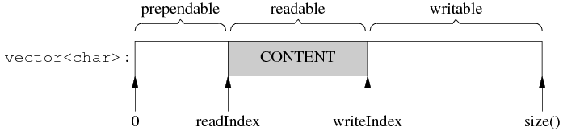

# distroChat

## 内容列表

- [背景](#背景)
- [前置模块讲解](#前置模块讲解)
- [设计思路以及代码结构](#设计思路以及代码结构)
- [系统的不足之处](#系统的不足之处)
- [项目中遇到的问题](#项目中遇到的问题)
- [安装说明](#安装说明)


## 背景
本项目是一个基于Reactor网络模型开发的网络库。它是一个高性能、跨平台的网络编程库，旨在提供稳定可靠的网络通信能力。通过使用该网络库，可以实现高并发、高效率的网络通信。但由于时间紧迫，目前只实现了服务器模块的开发，客户端模块还未实现。

**工作内容：**

+ 搭建了一个基于事件驱动的网络模型。它能够处理多个并发的TCP连接，包括连接的建立、断开、读写等操作。通过合理的连接管理，确保网络通信的稳定性和高效性。
+ 为了提高网络库的并发处理能力，集成了我自己实现的一个线程池。通过使用线程池，将每个网络连接的读写操作放入独立的线程中进行处理，从而避免了阻塞主线程的情况，并提高了网络库的整体性能。

+ 实现读写缓冲区。


## 前置模块讲解

线程池：[ThreadPool](https://gitee.com/jixu1340036583/threadpool)


## 设计思路以及代码结构


### 用到的I\O模型

我是将non-blocking 和 IO-multiplexing结合使用的，原因有二：

+ 如果单一使用non-blocking，意味着我们要通过轮询得来检查数据是否已经准备好，这会浪费大量的CPU周期；取而代之的是将non-blocking 和 IO-multiplexing结合使用，这种方法允许线程同时监听多个I\O操作；只有当至少有一个I\O操作完成时，线程才会被唤醒，从而避免了不必要的等待。
+ 如果单一采用blocking和IO-multiplexing就不合适了，因为任意的blocking I\O都会阻塞当前线程，如何客户端没有断联，那就导致线程一直被阻塞，无法处理其他的事件。

### 采用的触发方式

reactorX采用的是**水平触发方式**，理由如下：

首先是我认为水平触发的编程比较简单易用，其次是因为假设一次read()没有读完全部数据，下一次内核还可以通知有读事件，不会造成读取数据延迟的情况。


### I\O输入输出缓冲是如何实现的

我定义了一个Buffer类，对外表现为一段连续的内存，从尾部写入、从头部读出数据。对内是一个vector\<char>，大小可以自动增长。0-readIndex可以用于存储一个message的长度；readIndex-writeIndex用于存储可读数据，writeIndex-size()表示未使用空间。当读缓冲区时，readIndex会后移；当写缓冲区时，writeIndex会后移，当缓冲区被读完时，readIndex和writeIndex会回到prependable。


TcpConnection 会有两个 Buffer 成员，input buffer 与 output buffer：

+ input buffer，TcpConnection 会从 socket 读取数据，然后写入 input buffer（其实这一步是用 Buffer::readFd() 完成的）；客户代码从 input buffer 读取数据。
+ output buffer，客户代码会把数据写入 output buffer（通过调用 TcpConnection::send()）；TcpConnection从output buffer读取数据并写入 内核缓冲区。

#### Buffer::readFd()

对于一个I\O缓冲区来说，最重要的是要减少系统调用，一次读的数据越多越划算，同时单个缓冲区又不能占用太大的内存（如果有10k个连接，每个连接都建立64K的读缓冲，那么一共将占用640M的内存，而且大多时候这些内存的利用率都很低）。因此，代码中用readv结合了栈上的空间巧妙地实现了上述目标。

具体做法是：

+ **当有读事件发生时**，在栈上准备一个 65536 字节的 stackbuf，然后利用 readv() 来读取数据，iovec 有两块，第一块指向Buffer缓冲区中剩余可写的空间，另一块指向栈上的 stackbuf。这样如果读入的数据不多，那么全部都读到 Buffer 中去了；如果长度超过 Buffer 的 writable 字节数，就会读到栈上的 stackbuf 里，那么首先把缓冲区扩容，然后程序再把 stackbuf 里的数据 append 到 Buffer 中。
  这么做利用了临时栈上空间，避免开巨大 Buffer 造成的内存浪费，也避免反复调用 read() 的系统开销（通常一次 readv() 系统调用就能读完全部数据。**如果没有临时栈空间，由于使用的是水平触发，一次没读完的话，下次内核仍然会通知该事件，就要再次调用read()，使用栈空间就能确保我们调用一次readv就能读完全部数据**）。
+ **当有写事件发生时**，
  + 如果**当前读缓冲区为空**（针对内核来说）：那么就将data全部到内核缓冲区中，然后根据write的返回值，来判断一次是否全部写入成功，如果没有全部写入，那么将剩余还未写入的数据写入输出缓冲区，并向channel注册写事件；下次处理事件时调用handleWrite();
  + 如果**当前读缓冲区不为空**（针对内核来说），则不能直接向内核缓冲区写，因为TCP是字节流要保持有序，所以要将新数据追加到缓冲区的后面，继续注册写事件；

#### 缓冲区大小调整策略

Buffer的大小不是固定的，它是可以自动增长的，假设客户代码一次性写入 1000 字节，而当前可写的字节数只有 624，那么buffer会自动增长以容纳全部数据，这时readIndex 返回到了前面。由于 vector 重新分配了内存，原来指向它元素的指针会失效，这就是为什么 readIndex 和 writeIndex 是整数下标而不是指针。


### 整体流程
+ 首先定义一个EventLoop对象作为主反应堆，专门负责客户端的连接；其构造函数中会对poller对象进行初始化，其构造函数中会调用epoll_create;
+ 然后定义一个TcpServer对象，在其构造函数内：将刚定义的EventLoop对象传入作为主反应堆；同时定义acceptor_对象，设置setReadCallback回调（handleRead，里面调用newConnection回调），这里的回调主要是;启动线程池；给accept设置newConnection回调，旨在给子loop分发客户端链接；
+ 然后设置TcpServer的线程池数量，以及连接回调和消息回调。


+ 执行TcpServer::start()开启监听，主要是启动accept的listen()

+ 执行EventLoop::loop()开启事件循环，主要是启动poller::poll(epoll_wait)，然后填充活跃事件数组；进而执行回调channel->handleEvent(pollReturnTime_);


+ 对于新连接来说，在Acceptor::listen()::acceptChannel_.enableReading();里添加到监视数组中；
这里补充一下：
```c++
void Acceptor::listen()
{
    listenning_ = true;
    acceptSocket_.listen(); // listen
    acceptChannel_.enableReading(); // acceptChannel_ => Poller
}

// 在这里设置了关注的事件，然后通过loop中的poller的poller_->updateChannel(channel);来向监视数组中添加fd或者删除fd
void Channel::enableReading() { events_ |= kReadEvent; update(); }

然后根据channel的index来判断是要添加、更新、删除fd，初始index是=-1的，也就是KNew（添加fd）。
```


#### TcpServer::newConnection
这个函数是当主反应堆有新连接请求时执行的回调。
首先，TcpServer构造时，在初始值定义了acceptor主反应堆对象->
在acceptor的构造函数体中给主反应堆的唯一channel(因为监听描述符只有一个)设置了setReadCallback读事件的回调函数(handleRead),在handleread中会调用newConnectionCallback_（也就是newConnection），但此时还没设置这个回调->
然后在TcpServer的构造函数体中给acceptor设置回调setNewConnectionCallback；

TcpServer::Start中：
loop_->runInLoop(std::bind(&Acceptor::listen, acceptor_.get()));
将监听描述符放进监视数组中，执行listen();
然后在EventLoop::loop()中，执行Poller:poll，填充活跃事件数组；
然后根据返回的channel的事件类型执行相应的回调函数


在来看newConnection做了什么：
首先选择一个子反应堆；
输出日志信息；
获取本地ip和端口；
创建一个新的TcpConnection；
给conn设置各种回调；

在这里将新套接字描述符添加到监视数组中：ioLoop->runInLoop(std::bind(&TcpConnection::connectEstablished, conn));

EventLoop::runInLoop(Functor cb) 这个函数需要好好理解下！
理解了，这里应该是处理当子反应堆线程为0时，那么就是单线程，执行到这了肯定可以直接执行回调函数的；
如果不是有多个子线程，那么就把这个回调pendingFunctors_.emplace_back(cb);等待执行
然后
```c++
if (isInLoopThread()) 
{
    cb();
}
else // 在非当前loop线程中执行cb , 就需要唤醒loop所在线程，执行cb
{
    queueInLoop(cb);
}
```
在queueInLoop中：如果没在当前线程（说明可能还没有读事件产生被阻塞了），或者正在执行回调函数（因为正在执行的话，刚添加的回调是不会执行的），那么在pendingFunctors_.emplace_back(cb);后，就需要唤醒一下该poller，
```c++
   if (!isInLoopThread() || callingPendingFunctors_) 
    {
        wakeup(); // 唤醒loop所在线程
    }
```


#### noncopyable代码 √

```c++
#pragma once

class noncopyable{
public:
    // 拷贝构造函数和拷贝赋值运算符设置为删除的，一拷贝构造或者赋值就会报错;
    // 由于子类拷贝时也要调用父类的拷贝构造，但是这里被删除了所以编译器找不到进而报错
    noncopyable(const noncopyable&) = delete;
    noncopyable& operator=(const noncopyable&) = delete;
protected:
    // 这个类没有必要实例化，但它的子类需要实例化，并且构造过程中要首先调用父类的构造函数
    // 因此构造函数和析构函数设置成protected，以便子类能使用它。
    noncopyable() = default;
    ~noncopyable() = default;
};
```


#### InetAddress
封装ip和port组成的ipv4地址。

需要补充的是，新型网络地址转化函数inet_pton和inet_ntop。这两个函数是随IPv6出现的函数，对于IPv4地址和IPv6地址都适用，函数中p和n分别代表表达（presentation)和数值（numeric)。地址的表达格式通常是ASCII字符串，数值格式则是存放到套接字地址结构的二进制值。
```c++
#include <arpe/inet.h>
//将点分十进制的ip地址转化为用于网络传输的数值格式
int inet_pton(int family, const char *strptr, void *addrptr);     
//返回值：若成功则为1，若输入不是有效的表达式则为0，若出错则为-1

//将数值格式转化为点分十进制的ip地址格式
const char * inet_ntop(int family, const void *addrptr, char *strptr, size_t len);     
// 返回值：若成功则为指向结构的指针，若出错则为NULL
```
（1）这两个函数的family参数既可以是AF_INET（ipv4）也可以是AF_INET6（ipv6）。如果，以不被支持的地址族作为family参数，这两个函数都返回一个错误，并将errno置为EAFNOSUPPORT.
（2）第一个函数尝试转换由strptr指针所指向的字符串，并通过addrptr指针存放二进制结果，若成功则返回值为1，否则如果所指定的family而言输入字符串不是有效的表达式格式，那么返回值为0.

（3）inet_ntop进行相反的转换，从数值格式（addrptr）转换到表达式（strptr)。inet_ntop函数的strptr参数不可以是一个空指针。调用者必须为目标存储单元分配内存并指定其大小，调用成功时，这个指针就是该函数的返回值。len参数是目标存储单元的大小，以免该函数溢出其调用者的缓冲区。如果len太小，不足以容纳表达式结果，那么返回一个空指针，并置为errno为ENOSPC。


#### EventLoop
首先，它有一个成员Poller，在Poller的构造函数中会调用epoll_create；
然后在它的loop循环中，会调用Poller的poll方法，也就是epoll_wait，当有事件返回时，把活跃事件填到数组里面返回给EventLoop，进而执行收到数据后的回调。


#### TCPServer
有以下成员：
loop_:作为主反应堆，专门接收客户端的连接
acceptor_：设置socket连接相关
threadPool_：线程池，也就是子反应堆


## 系统的不足之处
+ ReactorX中的缓冲区用环形队列可能会更好，但是由于缓存区较大，deque在数据存取上的性能也未必比vector好。
+ 没有采用零拷贝。一是由于零拷贝编程比较复杂，还未掌握。二是由于我这个网络库主要是为了服务于分布式框架。而且常用的千兆以太网的裸吞吐量是125MB/s，而服务器内存的带宽至少是4GB/s，因此对于几十k大小的数据，在内存里拷贝几次的性能损失几乎可以忽略不计。


## 项目中遇到的问题


## 安装说明

开发环境：Ubuntu VsCode

编译器：g++

编译工具：CMake

编程语言：C++


